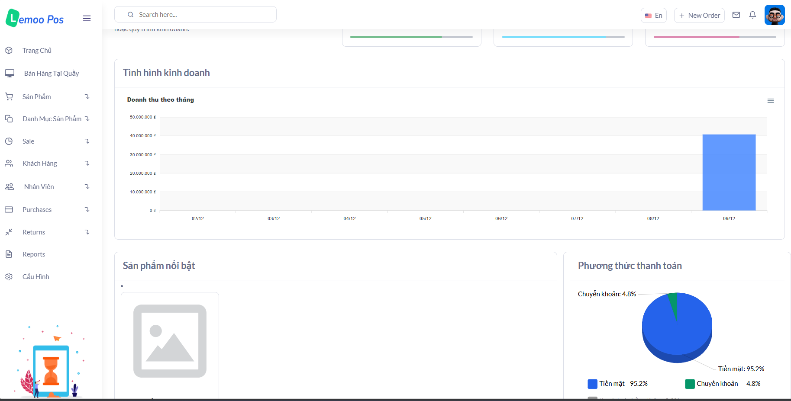
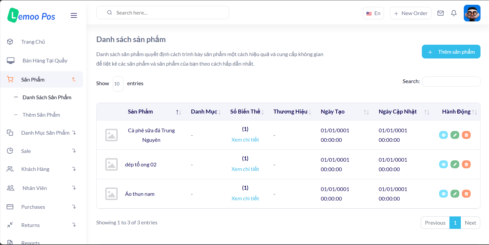
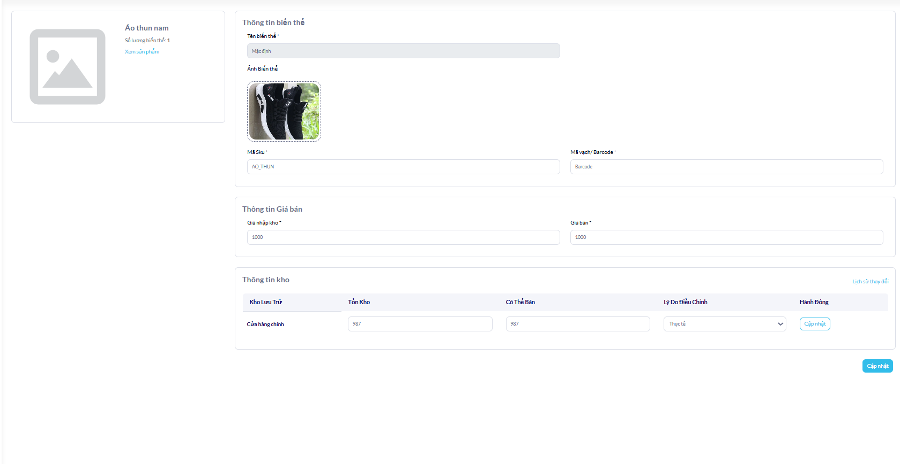
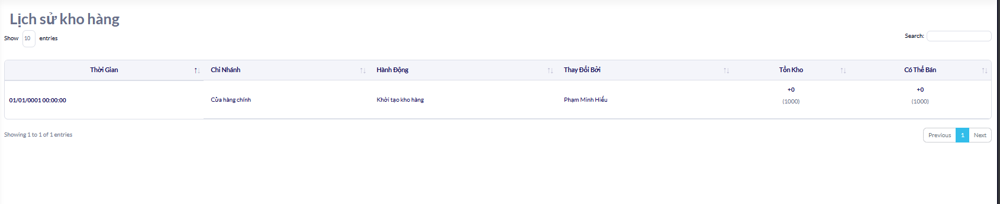
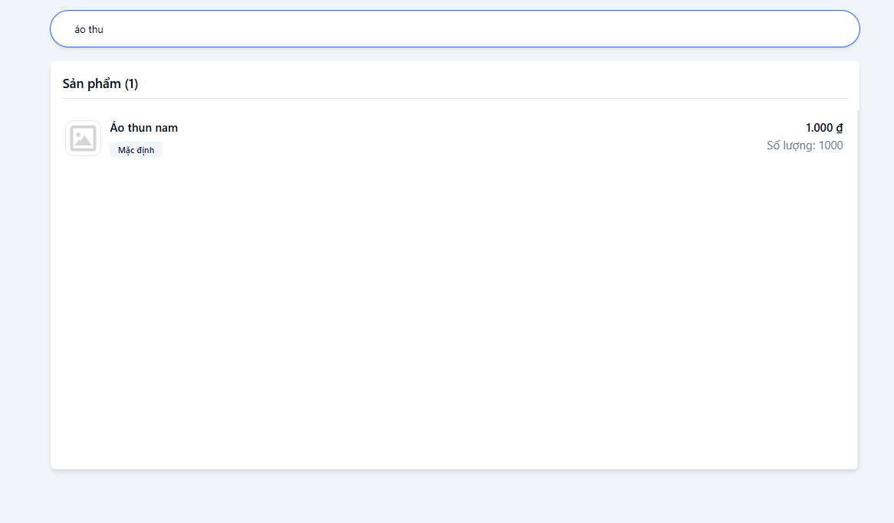

# Lemoo POS

## Hệ thống quản lý cửa hàng tạp hóa và siêu thị mini

-   [Lemoo POS](#lemoo-pos)
    -   [Hệ thống quản lý cửa hàng tạp hóa và siêu thị mini](#hệ-thống-quản-lý-cửa-hàng-tạp-hóa-và-siêu-thị-mini)
    -   [Tính năng nổi bật](#tính-năng-nổi-bật)
    -   [Công nghệ sử dụng](#công-nghệ-sử-dụng)
    -   [Thiết kế hệ thống](#thiết-kế-hệ-thống)
    -   [Cách chạy ứng dụng](#cách-chạy-ứng-dụng)
        -   [Chạy ứng dụng với docker](#chạy-ứng-dụng-với-docker)
        -   [Chạy ứng dụng trực tiếp](#chạy-ứng-dụng-trực-tiếp)
            -   [Đảm bảo đã cài đặt đủ môi trường để chạy ứng dụng](#đảm-bảo-đã-cài-đặt-đủ-môi-trường-để-chạy-ứng-dụng)
            -   [Các bước chạy ứng dụng](#các-bước-chạy-ứng-dụng)
    -   [Giao diện ứng dụng](#giao-diện-ứng-dụng)
        -   [Giao diện trang chủ](#giao-diện-trang-chủ)
        -   [Giao diện quản lý sản phẩm](#giao-diện-quản-lý-sản-phẩm)
        -   [Giao diện quản lý danh mục sản phẩm](#giao-diện-quản-lý-danh-mục-sản-phẩm)
        -   [Giao diện quản lý nhân viên](#giao-diện-quản-lý-nhân-viên)
        -   [Giao diện quản lý chi nhánh](#giao-diện-quản-lý-chi-nhánh)
        -   [Giao diện bán hàng tại quầy](#giao-diện-bán-hàng-tại-quầy)
        -   [Giao diện quản lý ca bán hàng](#giao-diện-quản-lý-ca-bán-hàng)
        -   [Giao diện tra cứu tồn kho](#giao-diện-tra-cứu-tồn-kho)
        -   [Giao diện thông tin đơn hàng](#giao-diện-thông-tin-đơn-hàng)
        -   [Giao diện đồng bộ đơn hàng](#giao-diện-đồng-bộ-đơn-hàng)

## Tính năng nổi bật

-   Quản lý sản phẩm (thêm và quản lý sản phẩm có nhiều biến thể)
-   Quản lý danh mục sản phẩm (thêm sản phẩm vào danh mục theo điều kiện)
-   Quản lý nhân viên (Phân quyền nhân viên động theo từng cửa hàng cụ thể)
-   Thống kê báo cáo doanh thu bán hàng
-   Hệ thống bán hàng đồng bộ tự động theo (offline first apps) cho phép người dùng bán hàng online và offline

## Công nghệ sử dụng

-   [ASP.NET Core MVC]() - Xây dựng hệ thống backend
-   [Reactjs]() - Phát triển giao diện bán hàng
-   [Postgresql]() - Database chính lưu trữ dữ liệu
-   [Redis]() - Cache và quản lý session
-   [Cloudinary]() - Lưu trữ hình ảnh
-   [RabbitMQ]() - Xử lý các chức năng bất đồng bộ (order, create_poduct, upload, ...)
-   [Elasticsearch]() - Hỗ trợ lưu trữ và tìm kiếm dữ liệu (sản phẩm, khách hàng, đơn hàng,...)
-   [Service worker]() - Hỗ trợ đăng ký các background sync job để đồng bộ sản phẩm

## Thiết kế hệ thống

**Database:** [Thiết kế database]()


## Cách chạy ứng dụng

#### Chạy ứng dụng với docker

Tạo file `.env` thay đầy đủ các giá trị trong file `example.env` trong thư mục project

```sh
docker run --env-file .env -p 7278:7278 zeustakeshi/lemoo-pos:latest
```

#### Chạy ứng dụng trực tiếp

##### Đảm bảo đã cài đặt đủ môi trường để chạy ứng dụng

-   [SDK .NET Core](https://dotnet.microsoft.com/download) (Phiên bản yêu cầu: .NET 8.0 trở lên)
-   Visual Studio (hoặc IDE bất kỳ hỗ trợ .NET Core, như Visual Studio Code)
-   Trình duyệt web (Chrome, Edge, Firefox, v.v.)

##### Các bước chạy ứng dụng

Bước 1: Clone dự án
Sử dụng Git để clone mã nguồn về máy tính của bạn:

```bash
git clone https://github.com/Zeustakeshi/Lemoo_pos_v2.git
cd Lemoo_pos_v2
```

Bước 2: Khôi phục gói nuget
Chạy lệnh sau để khôi phục các gói cần thiết cho dự án:

```bash
   dotnet restore
```

Bước 3: Chạy ứng dụng

```bash
   dotnet run
```

## Giao diện ứng dụng

### Giao diện trang chủ




### Giao diện quản lý sản phẩm







### Giao diện quản lý danh mục sản phẩm


### Giao diện quản lý nhân viên


### Giao diện quản lý chi nhánh


### Giao diện bán hàng tại quầy


### Giao diện quản lý ca bán hàng


### Giao diện tra cứu tồn kho



### Giao diện thông tin đơn hàng


### Giao diện đồng bộ đơn hàng


